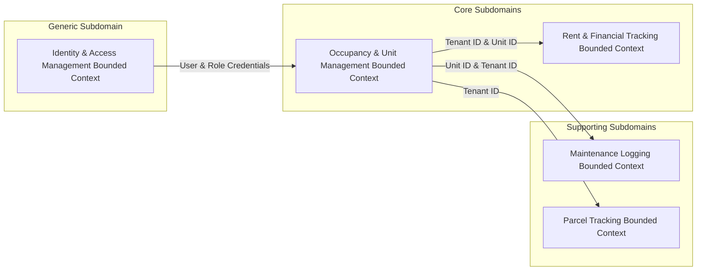

# Apartment Management System - Architecture & DDD Specification

> **Version:** 1.0.0  
> **Methodology:** Domain-Driven Design (DDD) & Clean Architecture (Onion Architecture)  
> **Target Platform:** .NET 8.0 / .NET 9.0 LTS (WPF Desktop Application)  
> **Persistence Engine:** Local Embedded SQLite / SQL Server Express (100% Offline)

---

## 1. Architectural Overview & Dependency Principles

The solution follows **Clean Architecture (Onion Architecture)** principles adapted for Domain-Driven Design. Core business domain rules, aggregates, and entities reside at the center of the application, completely isolated from user interface frameworks, database ORMs, and external libraries.

Dependencies flow **strictly inward**:

```
┌─────────────────────────────────────────────────────────┐
│                   Presentation Layer                    │
│           (WPF Desktop / CommunityToolkit.Mvvm)         │
└──────────────┬───────────────────────────┬──────────────┘
               │                           │
               ▼                           │
┌──────────────────────────────┐           │
│    Infrastructure Layer      │           │
│ (EF Core, SQLite, Serilog)   │           │
└──────────────┬───────────────┘           │
               │                           │
               ▼                           ▼
┌─────────────────────────────────────────────────────────┐
│                    Application Layer                    │
│   (Use Cases, Services, DTOs, Aggregate Repositories)  │
└──────────────┬──────────────────────────────────────────┘
               │
               ▼
┌─────────────────────────────────────────────────────────┐
│                      Domain Layer                       │
│  (Aggregates, Value Objects, Domain Events, Rules)      │
└─────────────────────────────────────────────────────────┘
```

### Strict Layer Dependency Rules:
1. **Domain Layer (`ApartmentManagementSystem.Domain`):** Pure C# business domain model. Zero dependencies on external NuGet packages, database frameworks, or UI controls.
2. **Application Layer (`ApartmentManagementSystem.Application`):** Depends exclusively on the **Domain Layer**. Defines application use cases, aggregate repository interfaces, DTOs, domain event handlers, and `IUnitOfWork`.
3. **Infrastructure Layer (`ApartmentManagementSystem.Infrastructure`):** Depends on **Application** and **Domain**. Implements database mapping using EF Core, repository implementations, password hashing, and local file logging (Serilog).
4. **Presentation Layer (`ApartmentManagementSystem.Desktop`):** Depends on **Application** (and **Infrastructure** strictly at the Composition Root for Dependency Injection setup). Implements WPF Views and MVVM ViewModels.

---

## 2. Solution & Physical Directory Structure

```
ApartmentManagmentSystem.sln
├── src/
│   ├── Core/
│   │   ├── ApartmentManagementSystem.Domain/             # Domain Layer (.csproj)
│   │   │   ├── Aggregates/                               # DDD Aggregates & Aggregate Roots
│   │   │   │   ├── ApartmentAggregate/                   # Apartment.cs (Root), OccupancyStatus.cs
│   │   │   │   ├── TenantAggregate/                      # Tenant.cs (Root)
│   │   │   │   ├── PaymentAggregate/                     # PaymentRecord.cs (Root), PaymentStatus.cs
│   │   │   │   ├── IssueAggregate/                       # Issue.cs (Root), IssueStatus.cs
│   │   │   │   ├── ParcelAggregate/                      # Parcel.cs (Root), ParcelStatus.cs
│   │   │   │   └── UserAggregate/                        # User.cs (Root), Role.cs
│   │   │   ├── ValueObjects/                             # Immutable Value Objects
│   │   │   │   ├── Money.cs                              # Rent/Payment amount encapsulation
│   │   │   │   ├── RentalPeriod.cs                       # Month (1-12) & Year tuple
│   │   │   │   ├── UnitNumber.cs                         # Apartment Unit identifier validation
│   │   │   │   └── PhoneNumber.cs                        # Contact phone number validation
│   │   │   ├── Events/                                   # Domain Events
│   │   │   │   ├── TenantAssignedToApartmentEvent.cs
│   │   │   │   ├── RentPaymentLoggedEvent.cs
│   │   │   │   ├── IssueResolvedEvent.cs
│   │   │   │   └── ParcelArrivedEvent.cs
│   │   │   ├── Exceptions/                               # Core Domain Invariant Exceptions
│   │   │   └── Common/                                   # AggregateRoot<TId>, Entity<TId>, ValueObject
│   │   │
│   │   └── ApartmentManagementSystem.Application/        # Application Layer (.csproj)
│   │       ├── Interfaces/                               # Service & Repository Abstractions
│   │       │   ├── Persistence/                          # IApplicationDbContext, IUnitOfWork
│   │       │   ├── Repositories/                         # Aggregate Repository Interfaces
│   │       │   └── Services/                             # IPasswordHasher, ICurrentUserService
│   │       ├── Services/                                 # Domain & Application Services
│   │       ├── DTOs/                                     # Data Transfer Objects
│   │       ├── Common/                                   # Result<T> Pattern & Pagination
│   │       └── DependencyInjection.cs                    # Application Service Registration
│   │
│   ├── Infrastructure/
│   │   └── ApartmentManagementSystem.Infrastructure/     # Infrastructure Layer (.csproj)
│   │       ├── Persistence/                              # EF Core AppDbContext & Configurations
│   │       │   ├── Configurations/                       # Entity Configurations (Fluent API)
│   │       │   ├── Repositories/                         # Concrete Repository Implementations
│   │       │   └── Migrations/                           # EF Core Migrations
│   │       ├── Security/                                 # Password Hashing Implementation
│   │       ├── Logging/                                  # Serilog File Logger Configuration
│   │       └── DependencyInjection.cs                    # Infrastructure DI Extension Methods
│   │
│   └── Presentation/
│       └── ApartmentManagementSystem.Desktop/           # Desktop Presentation Layer (.csproj)
│           ├── ViewModels/                               # MVVM ViewModels (CommunityToolkit.Mvvm)
│           ├── Views/                                    # XAML Views & Dialog Controls
│           ├── App.xaml / Program.cs                     # Composition Root & DI Setup
│           └── appsettings.json                          # Database Connection Strings & Settings
│
└── tests/
    ├── ApartmentManagementSystem.Domain.UnitTests/       # Domain Logic & Invariant Tests
    ├── ApartmentManagementSystem.Application.UnitTests/  # Application Service & Use Case Tests
    └── ApartmentManagementSystem.Infrastructure.Tests/   # EF Core Integration & Repository Tests
```

---

## 3. Domain-Driven Design (DDD) Tactical Specifications

### 3.1 Bounded Context Map



### 3.2 Aggregates & Domain Invariants

| Aggregate Root | Entities / Enums Included | Key Domain Invariants & Rules |
| :--- | :--- | :--- |
| **`Apartment`** | `OccupancyStatus` (`Vacant`, `Occupied`, `Maintenance`) | Rent cannot be negative. UnitNumber must be non-empty and unique. Cannot assign tenant if status is not `Vacant`. |
| **`Tenant`** | Contact Info | FullName and PhoneNumber are mandatory. EmergencyContact is optional. |
| **`PaymentRecord`**| `PaymentStatus` (`Paid`, `Partial`, `Pending`) | AmountPaid must be > 0. PaymentPeriodMonth must be between 1 and 12. Generates financial receipt. |
| **`Issue`** | `IssueStatus` (`Open`, `In Progress`, `Resolved`) | Description cannot exceed 500 chars. Status transitions must follow sequence (`Open` ➔ `In Progress` ➔ `Resolved`). ResolvedDate set automatically on resolution. |
| **`Parcel`** | `ParcelStatus` (`Pending Pickup`, `Picked Up`) | ArrivalTimestamp defaults to current time. Marking as `Picked Up` requires setting `PickupTimestamp`. |
| **`User`** | `Role` (`Building Owner`, `Building Manager`, `Tenant`) | Username and Email must be unique. Password must be cryptographically hashed. `TenantID` mandatory only for Tenant role. |

---

## 4. Code Examples (DDD & Clean Architecture Implementation)

### 4.1 Domain Layer: Aggregate Root Implementation

```csharp
namespace ApartmentManagementSystem.Core.Domain.Aggregates.ApartmentAggregate;

using ApartmentManagementSystem.Core.Domain.Common;
using ApartmentManagementSystem.Core.Domain.Events;
using ApartmentManagementSystem.Core.Domain.Exceptions;
using ApartmentManagementSystem.Core.Domain.ValueObjects;

public class Apartment : AggregateRoot<int>
{
    public UnitNumber UnitNumber { get; private set; } = null!;
    public int FloorNumber { get; private set; }
    public int NumberOfRooms { get; private set; }
    public Money MonthlyRent { get; private set; } = null!;
    public OccupancyStatus OccupancyStatus { get; private set; } = OccupancyStatus.Vacant;
    public int? CurrentTenantId { get; private set; }

    // EF Core Private Constructor
    private Apartment() { }

    public Apartment(UnitNumber unitNumber, int floorNumber, int numberOfRooms, Money monthlyRent)
    {
        if (floorNumber < 0)
            throw new DomainRuleException("Floor number cannot be negative.");
        if (numberOfRooms <= 0)
            throw new DomainRuleException("Number of rooms must be greater than zero.");

        UnitNumber = unitNumber ?? throw new ArgumentNullException(nameof(unitNumber));
        FloorNumber = floorNumber;
        NumberOfRooms = numberOfRooms;
        MonthlyRent = monthlyRent ?? throw new ArgumentNullException(nameof(monthlyRent));
        OccupancyStatus = OccupancyStatus.Vacant;
    }

    public void AssignTenant(int tenantId)
    {
        if (OccupancyStatus != OccupancyStatus.Vacant)
            throw new DomainRuleException($"Cannot assign tenant. Apartment is currently {OccupancyStatus}.");

        CurrentTenantId = tenantId;
        OccupancyStatus = OccupancyStatus.Occupied;

        AddDomainEvent(new TenantAssignedToApartmentEvent(Id, tenantId, DateTime.UtcNow));
    }

    public void VacateUnit()
    {
        CurrentTenantId = null;
        OccupancyStatus = OccupancyStatus.Vacant;
    }

    public void SetMaintenanceStatus()
    {
        if (OccupancyStatus == OccupancyStatus.Occupied)
            throw new DomainRuleException("Cannot set occupied unit to maintenance.");

        OccupancyStatus = OccupancyStatus.Maintenance;
    }
}
```

### 4.2 Application Layer: Repository Contracts & Unit of Work

```csharp
namespace ApartmentManagementSystem.Core.Application.Interfaces.Repositories;

using ApartmentManagementSystem.Core.Domain.Aggregates.ApartmentAggregate;

public interface IApartmentRepository
{
    Task<Apartment?> GetByIdAsync(int id, CancellationToken cancellationToken = default);
    Task<Apartment?> GetByUnitNumberAsync(string unitNumber, CancellationToken cancellationToken = default);
    Task<IReadOnlyList<Apartment>> GetAllAsync(CancellationToken cancellationToken = default);
    Task AddAsync(Apartment apartment, CancellationToken cancellationToken = default);
    void Update(Apartment apartment);
    void Delete(Apartment apartment);
}

public interface IUnitOfWork
{
    Task<int> SaveChangesAsync(CancellationToken cancellationToken = default);
}
```

### 4.3 Infrastructure Layer: EF Core DbContext & Configurations

```csharp
namespace ApartmentManagementSystem.Infrastructure.Persistence;

using Microsoft.EntityFrameworkCore;
using ApartmentManagementSystem.Core.Domain.Aggregates.ApartmentAggregate;
using ApartmentManagementSystem.Core.Domain.Aggregates.TenantAggregate;
using ApartmentManagementSystem.Core.Domain.Aggregates.PaymentAggregate;
using ApartmentManagementSystem.Core.Domain.Aggregates.IssueAggregate;
using ApartmentManagementSystem.Core.Domain.Aggregates.ParcelAggregate;
using ApartmentManagementSystem.Core.Domain.Aggregates.UserAggregate;

public class AppDbContext : DbContext
{
    public AppDbContext(DbContextOptions<AppDbContext> options) : base(options) { }

    public DbSet<Apartment> Apartments => Set<Apartment>();
    public DbSet<Tenant> Tenants => Set<Tenant>();
    public DbSet<PaymentRecord> PaymentRecords => Set<PaymentRecord>();
    public DbSet<Issue> Issues => Set<Issue>();
    public DbSet<Parcel> Parcels => Set<Parcel>();
    public DbSet<User> Users => Set<User>();
    public DbSet<Role> Roles => Set<Role>();

    protected override void OnModelCreating(ModelBuilder modelBuilder)
    {
        base.OnModelCreating(modelBuilder);
        modelBuilder.ApplyConfigurationsFromAssembly(typeof(AppDbContext).Assembly);
    }
}
```

### 4.4 Infrastructure Entity Configuration (Fluent API)

```csharp
namespace ApartmentManagementSystem.Infrastructure.Persistence.Configurations;

using Microsoft.EntityFrameworkCore;
using Microsoft.EntityFrameworkCore.Metadata.Builders;
using ApartmentManagementSystem.Core.Domain.Aggregates.ApartmentAggregate;
using ApartmentManagementSystem.Core.Domain.ValueObjects;

public class ApartmentConfiguration : IEntityTypeConfiguration<Apartment>
{
    public void Configure(EntityTypeBuilder<Apartment> builder)
    {
        builder.ToTable("Apartments");
        builder.HasKey(a => a.Id);
        builder.Property(a => a.Id).HasColumnName("ApartmentID");

        builder.Property(a => a.UnitNumber)
            .HasConversion(u => u.Value, v => new UnitNumber(v))
            .HasColumnName("UnitNumber")
            .HasMaxLength(20)
            .IsRequired();

        builder.HasIndex(a => a.UnitNumber).IsUnique();

        builder.Property(a => a.MonthlyRent)
            .HasConversion(m => m.Amount, a => new Money(a))
            .HasColumnName("MonthlyRent")
            .HasPrecision(10, 2)
            .IsRequired();

        builder.Property(a => a.OccupancyStatus)
            .HasConversion<string>()
            .HasMaxLength(20)
            .HasDefaultValue(OccupancyStatus.Vacant);

        builder.HasOne<Tenant>()
            .WithMany()
            .HasForeignKey(a => a.CurrentTenantId)
            .OnDelete(DeleteBehavior.SetNull);
    }
}
```

---

## 5. Composition Root & Dependency Injection Setup

Presentation layer bootstrapping in `App.xaml.cs` or `Program.cs` wires up IoC containers:

```csharp
namespace ApartmentManagementSystem.Desktop;

using Microsoft.Extensions.DependencyInjection;
using Microsoft.EntityFrameworkCore;
using ApartmentManagementSystem.Infrastructure.Persistence;
using ApartmentManagementSystem.Core.Application.Interfaces.Repositories;
using ApartmentManagementSystem.Infrastructure.Persistence.Repositories;

public static class ServiceConfigurator
{
    public static IServiceCollection ConfigureServices(IServiceCollection services, string connectionString)
    {
        // 1. DbContext Registration
        services.AddDbContext<AppDbContext>(options =>
            options.UseSqlite(connectionString));

        // 2. Unit of Work & Repositories
        services.AddScoped<IUnitOfWork, UnitOfWork>();
        services.AddScoped<IApartmentRepository, ApartmentRepository>();
        services.AddScoped<ITenantRepository, TenantRepository>();
        services.AddScoped<IPaymentRecordRepository, PaymentRecordRepository>();

        // 3. Application Services
        services.AddScoped<RentCalculatorDomainService>();

        // 4. ViewModels
        services.AddTransient<MainViewModel>();
        services.AddTransient<ApartmentsViewModel>();
        services.AddTransient<PaymentsViewModel>();

        return services;
    }
}
```

---

## 6. Cross-Cutting Concerns

| Concern | Technology / Pattern | Purpose |
| :--- | :--- | :--- |
| **Data Access & ORM** | Entity Framework Core (EF Core) | Encapsulates SQL database access and migrations. |
| **Local Database Engine** | SQLite (Embedded) / SQL Server Express | 100% offline database operational continuity. |
| **Password Security** | PBKDF2 with Salt / BCrypt | Hashing credentials prior to database persistence. |
| **Local Logging** | Serilog (`Serilog.Sinks.File`) | Structured error and audit logging to local disk. |
| **Validation** | FluentValidation | Clean separation of UI/DTO validation rules. |
| **UI Data Binding** | `CommunityToolkit.Mvvm` | Reactive MVVM ViewModels for WPF Desktop controls. |
