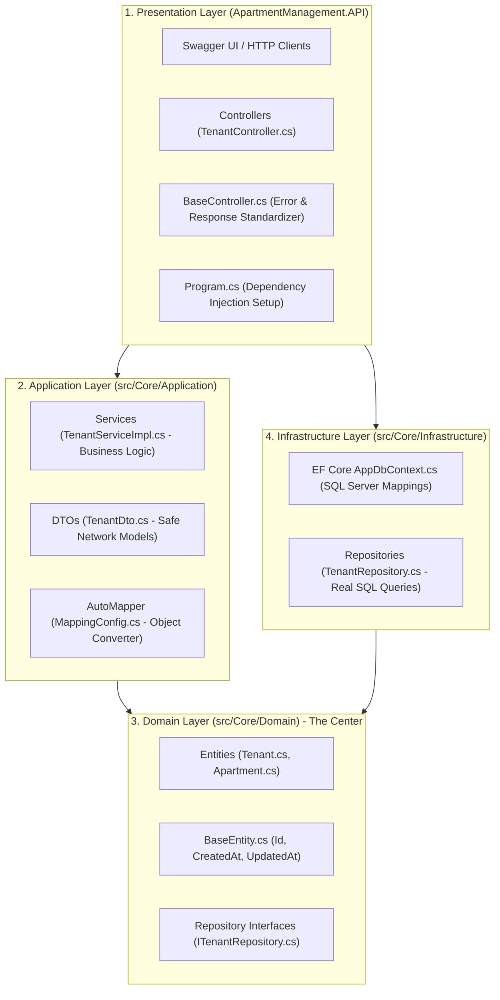
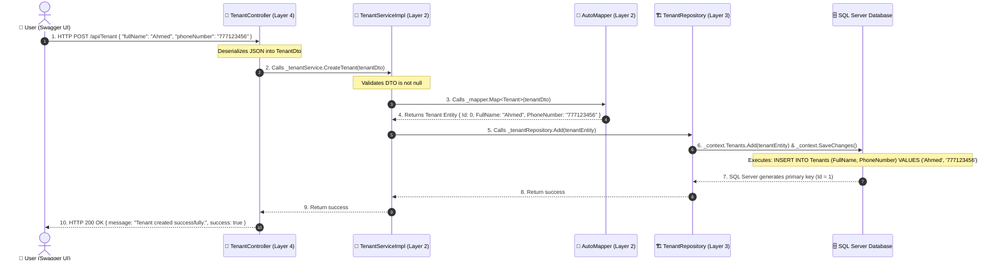

# Backend Architecture Explained (A Beginner's Guide)

> **Welcome!** If you only know basic coding syntax (variables, loops, methods, and simple classes) and feel lost looking at terms like *Clean Architecture*, *DTOs*, *Repositories*, *Services*, *DbContext*, and *Dependency Injection*, this guide is designed specifically for you.

---

## 📑 Table of Contents
1. [The Big Picture: Why Do We Need Architecture?](#1-the-big-picture-why-do-we-need-architecture)
2. [The 4 Layers of Our Architecture](#2-the-4-layers-of-our-architecture)
   - [Layer 1: Domain (The Blueprint & Core Rules)](#layer-1-domain-the-blueprint--core-rules)
   - [Layer 2: Application (The Brain & Business Workflows)](#layer-2-application-the-brain--business-workflows)
   - [Layer 3: Infrastructure (The Database Heavy-Lifter)](#layer-3-infrastructure-the-database-heavy-lifter)
   - [Layer 4: Presentation / API (The Front Desk)](#layer-4-presentation--api-the-front-desk)
3. [Deep Dive: How the Layers Interact With Each Other](#3-deep-dive-how-the-layers-interact-with-each-other)
   - [Interaction Map & Object Flow](#interaction-map--object-flow)
   - [Why Layer 2 Does Not Depend on Layer 3 (Dependency Inversion)](#why-layer-2-does-not-depend-on-layer-3-dependency-inversion)
   - [Why Layer 4 Does Not Talk to the Database](#why-layer-4-does-not-talk-to-the-database)
4. [Core Concepts Explained in Plain English](#4-core-concepts-explained-in-plain-english)
   - [Why do we use Interfaces? (The Wall Socket Analogy)](#why-do-we-use-interfaces-the-wall-socket-analogy)
   - [What is a DTO and why do we use AutoMapper?](#what-is-a-dto-and-why-do-we-use-automapper)
   - [What is Dependency Injection (DI)?](#what-is-dependency-injection-di)
   - [How BaseController Standardizes API Responses](#how-basecontroller-standardizes-api-responses)
5. [Step-by-Step Walkthrough: Registering a New Tenant](#5-step-by-step-walkthrough-registering-a-new-tenant)
6. [Codebase Map (Where to Find What)](#6-codebase-map-where-to-find-what)
7. [Beginner Cheat Sheet & Glossary](#7-beginner-cheat-sheet--glossary)
8. [Detailed Layer Interaction Walkthrough](#8-detailed-layer-interaction-walkthrough)
9. [Every Class Type Explained](#9-every-class-type-explained)

---

## 1. The Big Picture: Why Do We Need Architecture?

When you first learn programming, it is natural to write everything in one single file:

```csharp
// The beginner "All-in-One" file
void Main()
{
    // 1. Read input from user
    // 2. Validate data
    // 3. Connect to SQL database
    // 4. Save to table
    // 5. Print success message
}
```

### The Problem: The "Overworked Restaurant Owner" Analogy
Imagine a restaurant where **one single person** is the waiter, the master chef, the dishwasher, the grocery buyer, and the cashier at the same time:
* If the cashier system crashes, nobody can cook.
* If you want to change a recipe in the kitchen, you might accidentally break the billing register.
* It is impossible to test, messy to maintain, and completely falls apart when the project grows.

### The Solution: Clean / Layered Architecture
In a well-run restaurant, duties are strictly separated into **specialized roles**:
1. **The Waiter (API / Controllers):** Greets customers at the front desk, takes orders, and returns food.
2. **The Head Chef (Application Services):** Takes the order, validates recipes, and coordinates preparation.
3. **The Kitchen & Pantry Staff (Infrastructure / Repositories):** Goes into the pantry (database) to store and retrieve ingredients.
4. **The Menu & Ingredients (Domain Entities):** The core definitions of what items and ingredients exist.

---

## 2. The 4 Layers of Our Architecture

Here is how our solution ([`ApartmentManagementSystem.sln`](ApartmentManagementSystem.sln)) is structured:



---

### Layer 1: Domain (`src/Core/Domain`)
> **Summary:** The core foundation. It defines **what** exists in our world, with zero external dependencies.

Domain does not care about databases, Web APIs, or user interfaces. It only contains the pure rules of our business.

#### 1. Entities (The Data Models)
An **Entity** represents a real-world object that will be stored in our database.

Look at [`src/Core/Domain/Entities/Tenant.cs`](src/Core/Domain/Entities/Tenant.cs):
```csharp
public class Tenant : BaseEntity
{
    public string FullName { get; set; } = string.Empty;
    public string PhoneNumber { get; set; } = string.Empty;
    public string? EmergencyContact { get; set; }

    // Relationships to other entities
    public List<Apartment> Apartments { get; set; } = new List<Apartment>();
    public List<PaymentRecord> PaymentRecords { get; set; } = new List<PaymentRecord>();
    public List<Issue> Issues { get; set; } = new List<Issue>();
    public List<Parcel> Parcels { get; set; } = new List<Parcel>();
}
```
*Notice:* Every entity inherits from [`BaseEntity.cs`](src/Core/Domain/Entities/Base/BaseEntity.cs), giving each record an `Id`, `CreatedAt`, and `UpdatedAt` automatically.

#### 2. Repository Interfaces (The Job Descriptions)
Domain also defines **Interfaces** (contracts) like [`ITenantRepository.cs`](src/Core/Domain/IRepository/ITenantRepository.cs):
```csharp
public interface ITenantRepository
{
    void Add(Tenant tenant);
    void Update(Tenant tenant);
    void Delete(int id);
    Tenant? GetById(int id);
    List<Tenant> GetAll();
}
```
An interface does **not** contain code. It is simply a list of required operations. It says: *"Whoever implements me must provide Add, Update, Delete, GetById, and GetAll."*

---

### Layer 2: Application (`src/Core/Application`)
> **Summary:** The Brain. It handles business logic, converts data, coordinates workflows, and organizes operations.

The Application layer connects the outside world (API) with the inner domain. It knows **what business rules must happen** when an action is triggered.

#### 1. Why Did We Write This Layer?
Without this layer, your API Controllers would have to do everything: talk to SQL, check business rules, catch database errors, and map fields. 

By having the Application layer:
* **Business rules are centralized:** E.g., checking if an apartment is vacant before assigning a tenant, validating payment amounts, or auto-setting pickup timestamps.
* **Reusable across different UIs:** If tomorrow you build a Windows Desktop GUI (WPF), a Web app (React/Blazor), or a mobile app, **the entire Application layer is 100% reused without changing a single line of code**.

#### 2. Anatomy of the Application Layer Code

##### A. DTOs (Data Transfer Objects) — e.g. [`TenantDto.cs`](src/Core/Application/DTOs/TenantDto.cs)
```csharp
public class TenantDto
{
    public int Id { get; set; }
    public string FullName { get; set; } = string.Empty;
    public string PhoneNumber { get; set; } = string.Empty;
    public string? EmergencyContact { get; set; }
}
```

* **Why not send the raw `Tenant.cs` entity to Swagger/API?**
  1. **Circular Reference Prevention:** `Tenant` has a `List<PaymentRecord>`, and each `PaymentRecord` has a `Tenant`. Sending raw entities makes the JSON serializer loop forever and crash the server.
  2. **Security & Privacy:** If an entity has private data (like `PasswordHash` in `User`), the DTO omits it so it is never exposed over the network.
  3. **Stability:** If you add an internal column to the SQL database table, the external API format remains untouched.

##### B. Service Interfaces — e.g. [`ITenantService.cs`](src/Core/Application/Interfaces/ITenantService.cs)
```csharp
public interface ITenantService
{
    void CreateTenant(TenantDto tenantDto);
    TenantDto? GetTenantById(int id);
    IEnumerable<TenantDto> GetAllTenants();
    void UpdateTenant(TenantDto tenantDto);
    void DeleteTenant(int id);
}
```
* **Why write an interface for services?**
  It defines the contract of what the application can do. The API controllers only reference `ITenantService`, which makes testing easy and prevents the API from knowing how the service is coded inside.

##### C. Service Implementations — e.g. [`TenantServiceImpl.cs`](src/Core/Application/ServiceImpl/TenantServiceImpl.cs)
```csharp
public class TenantServiceImpl : ITenantService
{
    private readonly ITenantRepository _tenantRepository;
    private readonly IMapper _mapper;

    // 1. Ask for dependencies via Constructor Injection
    public TenantServiceImpl(ITenantRepository tenantRepository, IMapper mapper)
    {
        _tenantRepository = tenantRepository;
        _mapper = mapper;
    }

    public void CreateTenant(TenantDto tenantDto)
    {
        // 2. Validate input
        if (tenantDto == null) throw new ArgumentNullException(nameof(tenantDto));

        // 3. Convert DTO -> Database Entity
        var tenantEntity = _mapper.Map<Tenant>(tenantDto);

        // 4. Save to database via repository
        _tenantRepository.Add(tenantEntity);
    }
}
```

##### D. AutoMapper Profile — [`MappingConfig.cs`](src/Core/Application/Mappings/MappingConfig.cs)
```csharp
public class MappingProfile : Profile
{
    public MappingProfile()
    {
        CreateMap<Tenant, TenantDto>().ReverseMap();
        CreateMap<Apartment, ApartmentDto>().ReverseMap();
        // ...
    }
}
```
* **Why use AutoMapper?**
  It saves you from writing manual mapping code (`entity.FullName = dto.FullName; entity.PhoneNumber = dto.PhoneNumber; ...`) on every single method. AutoMapper copies all matching properties automatically in one line: `_mapper.Map<Tenant>(dto)`.

---

### Layer 3: Infrastructure (`src/Core/Infrastructure`)
> **Summary:** The Database Worker. It writes and reads real records in SQL Server using **Entity Framework Core (EF Core)**.

Infrastructure implements the repository interfaces defined in the Domain layer.

#### 1. Why Did We Write This Layer?
We want our business logic (Application layer) to be completely independent from database technologies.
* If you decide to switch from **Microsoft SQL Server** to **SQLite** (for a 100% offline portable desktop app) or **PostgreSQL**, **you only touch the Infrastructure layer**. Domain, Application, and Controllers do not change at all.

#### 2. Anatomy of the Infrastructure Layer Code

##### A. `AppDbContext.cs` (The Database Session) — [`AppDbContext.cs`](src/Core/Infrastructure/Data/AppDbContext.cs)
```csharp
public class AppDbContext : DbContext
{
    public AppDbContext(DbContextOptions<AppDbContext> options) : base(options) { }

    public DbSet<Tenant> Tenants { get; set; }
    public DbSet<Apartment> Apartments { get; set; }
    public DbSet<PaymentRecord> PaymentRecords { get; set; }
    public DbSet<Issue> Issues { get; set; }
    public DbSet<Parcel> Parcels { get; set; }
    public DbSet<User> Users { get; set; }
    public DbSet<Role> Roles { get; set; }

    protected override void OnModelCreating(ModelBuilder modelBuilder)
    {
        base.OnModelCreating(modelBuilder);

        // Configure Apartment table rules
        modelBuilder.Entity<Apartment>(entity =>
        {
            entity.HasIndex(e => e.UnitNumber).IsUnique();
            entity.Property(e => e.MonthlyRent).HasColumnType("decimal(10,2)");
            entity.HasOne(e => e.CurrentTenant)
                  .WithMany(t => t.Apartments)
                  .HasForeignKey(e => e.CurrentTenantId)
                  .OnDelete(DeleteBehavior.SetNull); // When tenant moves out, unit becomes Vacant (NULL)
        });
    }
}
```
* **What `AppDbContext` does:**
  * `DbSet<Tenant> Tenants`: Represents the `Tenants` table in SQL Server.
  * `OnModelCreating`: Configures database rules using EF Core Fluent API:
    * `IsUnique()`: Enforces unique unit numbers and email addresses.
    * `HasColumnType("decimal(10,2)")`: Ensures zero floating-point rounding errors on rent and payments.
    * `OnDelete(DeleteBehavior.SetNull)`: Protects data relationships.

##### B. Repository Implementation — e.g. [`TenantRepository.cs`](src/Core/Infrastructure/Repositories/TenantRepository.cs)
```csharp
public class TenantRepository : ITenantRepository
{
    private readonly AppDbContext _context;

    public TenantRepository(AppDbContext context)
    {
        _context = context;
    }

    public void Add(Tenant tenant)
    {
        _context.Tenants.Add(tenant); // Marks entity as "Added" in memory
        _context.SaveChanges();      // Generates and executes: INSERT INTO Tenants (...) VALUES (...)
    }

    public Tenant? GetById(int id)
    {
        return _context.Tenants.Find(id); // Generates: SELECT TOP(1) * FROM Tenants WHERE Id = @id
    }

    public List<Tenant> GetAll()
    {
        return _context.Tenants.ToList(); // Generates: SELECT * FROM Tenants
    }

    public void Update(Tenant tenant)
    {
        _context.Tenants.Update(tenant);
        _context.SaveChanges(); // Generates: UPDATE Tenants SET ... WHERE Id = @id
    }

    public void Delete(int id)
    {
        var tenant = _context.Tenants.Find(id);
        if (tenant != null)
        {
            _context.Tenants.Remove(tenant);
            _context.SaveChanges(); // Generates: DELETE FROM Tenants WHERE Id = @id
        }
    }
}
```
* **Why use the Repository Pattern when EF Core is already an ORM?**
  1. **Encapsulates Database Code:** If you need to change how data is queried (e.g. adding caching, soft-deletes, or stored procedures), you do it in one place.
  2. **Testability:** During testing, you can substitute a fake in-memory repository without spinning up a real SQL Server database.

---

### Layer 4: Presentation / API (`ApartmentManagement.API`)
> **Summary:** The Front Desk / Receptionist. It exposes HTTP REST endpoints that outside clients (Swagger, web browsers, desktop UIs) can communicate with.

#### 1. Why Did We Write This Layer?
The API layer handles all **network protocol concerns**:
* Routing URLs (`/api/Tenant`, `/api/Apartment`).
* Deserializing JSON text from HTTP requests into C# objects (`[FromBody] TenantDto`).
* Formatting HTTP responses and assigning correct HTTP status codes (`200 OK`, `400 Bad Request`, `404 Not Found`, `500 Server Error`).
* Generating Swagger documentation.

#### 2. Anatomy of the Presentation Layer Code

##### A. Base Controller — [`BaseController.cs`](src/Core/ApartmentManagement.API/Controllers/BaseController.cs)
```csharp
[ApiController]
[Route("api/[controller]")]
public abstract class BaseController : ControllerBase
{
    protected readonly ILogger<BaseController> Logger;

    protected BaseController(ILogger<BaseController> logger)
    {
        Logger = logger;
    }

    protected IActionResult HandleResponse<T>(T result, string message = null)
    {
        if (result == null)
        {
            Logger.LogWarning("Requested resource not found.");
            return NotFound(new { message = "Resource not found.", success = false });
        }
        return Ok(result);
    }

    protected IActionResult HandleError(Exception ex, string message = "An unexpected error occurred.")
    {
        Logger.LogError(ex, message);
        return StatusCode(500, new { message = message, success = false, error = ex.Message });
    }
}
```
* **Why did we write `BaseController`?**
  Instead of repeating `try-catch` blocks and error logging in all 7 controllers, `BaseController` centralizes error logging, ensures consistent JSON responses, and returns standard status codes automatically.

##### B. API Controller — e.g. [`TenantController.cs`](src/Core/ApartmentManagement.API/Controllers/TenantController.cs)
```csharp
[ApiController]
[Route("api/[controller]")]
public class TenantController : BaseController
{
    private readonly ITenantService _tenantService;

    // Asks DI for ITenantService
    public TenantController(ILogger<TenantController> logger, ITenantService tenantService)
        : base(logger)
    {
        _tenantService = tenantService;
    }

    [HttpPost]
    public IActionResult Create([FromBody] TenantDto tenantDto)
    {
        try
        {
            if (tenantDto == null)
            {
                return BadRequest(new { message = "Invalid tenant data.", success = false });
            }
            _tenantService.CreateTenant(tenantDto);
            return HandleResponse(new { message = "Tenant created successfully.", success = true });
        }
        catch (Exception ex)
        {
            return HandleError(ex, "Failed to create tenant.");
        }
    }

    [HttpGet("{id}")]
    public IActionResult GetById(int id)
    {
        try
        {
            var tenant = _tenantService.GetTenantById(id);
            return HandleResponse(tenant);
        }
        catch (Exception ex)
        {
            return HandleError(ex, $"Failed to retrieve tenant with ID {id}.");
        }
    }
}
```

##### C. The Wiring Center / Composition Root — [`Program.cs`](src/Core/ApartmentManagement.API/Program.cs)
`Program.cs` is where all the puzzle pieces are plugged together at startup:

```csharp
// 1. Tell EF Core to connect to SQL Server
services.AddDbContext<AppDbContext>(options =>
    options.UseSqlServer(configuration.GetConnectionString("DefaultConnection")));

// 2. Register Repositories: Whenever ITenantRepository is requested, supply TenantRepository
services.AddScoped<ITenantRepository, TenantRepository>();
services.AddScoped<IApartmentRepository, ApartmentRepository>();
// ...

// 3. Register Services: Whenever ITenantService is requested, supply TenantServiceImpl
services.AddScoped<ITenantService, TenantServiceImpl>();
services.AddScoped<IApartmentService, ApartmentServiceImpl>();
// ...

// 4. Register AutoMapper
services.AddAutoMapper(AppDomain.CurrentDomain.GetAssemblies());

// 5. Register Swagger Documentation
services.AddSwaggerGen(c =>
{
    c.SwaggerDoc("v1", new OpenApiInfo { Title = "Apartment Management API", Version = "v1" });
});
```

---

## 3. Deep Dive: How the Layers Interact With Each Other

### Interaction Map & Object Flow

```
[Outside World] ──(JSON String)──> [Layer 4: Controller]
                                           │
                                     (TenantDto)
                                           ▼
                                 [Layer 2: Service]
                                    │             │
                             (Uses AutoMapper)  (Calls Interface)
                                    │             │
                              (Tenant Entity)     ▼
                                    │       [Layer 1: Domain Interface]
                                    ▼             ▲
                          [Layer 3: Repository]───┘ (Implements Contract)
                                    │
                              (AppDbContext)
                                    ▼
                         [SQL Server Database]
```

### Why Layer 2 Does Not Depend on Layer 3 (Dependency Inversion)
Look closely at the arrows above:
* `TenantServiceImpl` (Layer 2) **never mentions** `TenantRepository` or `AppDbContext` (Layer 3).
* Instead, `TenantServiceImpl` only depends on the **Interface** `ITenantRepository` (Layer 1).
* `TenantRepository` (Layer 3) also depends on `ITenantRepository` (Layer 1) to implement it.

This is the **Dependency Inversion Principle (DIP)**:
> High-level business logic (Services) should not depend on low-level database details (SQL Repositories). Both should depend on abstractions (Interfaces).

### Why Layer 4 Does Not Talk to the Database
If a controller talked directly to the database:
1. You couldn't validate complex business rules before saving.
2. You couldn't reuse the database code for other controllers or desktop screens.
3. If the database was slow or down, the API would have no clean way to handle the error.

---

## 4. Core Concepts Explained in Plain English

### Why do we use Interfaces? (The Wall Socket Analogy)
Think of an electrical wall outlet in your home:
* The wall socket is an **Interface** (`ITenantRepository`). It specifies the shape of the holes and the voltage.
* The device plugged in is the **Implementation** (`TenantRepository`). It could be a lamp, a fan, or a phone charger.

Because your house is built with standard socket interfaces, you can unplug a lamp and plug in a fan without rewiring your house.

Similarly, in our code:
`TenantServiceImpl` only knows `ITenantRepository`. If tomorrow we decide to switch from Microsoft SQL Server to SQLite, PostgreSQL, or an in-memory testing database, we only write a new repository class. **We do not have to change a single line of business logic!**

---

### What is a DTO and why do we use AutoMapper?

| Database Entity (`Tenant.cs`) | Data Transfer Object (`TenantDto.cs`) |
| :--- | :--- |
| Represents the raw database table. | Represents data sent to or received from the API. |
| Includes table foreign keys, complex relations, and internal fields. | Contains only the clean, safe fields the user needs. |
| Stays strictly inside backend layers (`Domain` / `Infrastructure`). | Safely passed across the network (`Application` / `API`). |

**AutoMapper** automatically copies matching properties between `Tenant` and `TenantDto` so you don't have to write 20 lines of manual assignment code for every request.

---

### What is Dependency Injection (DI)?

#### Without Dependency Injection (Tightly Coupled - Bad Practice):
```csharp
public class TenantServiceImpl
{
    // Hardcoded! Glued forever to TenantRepository and SQL Server!
    private TenantRepository _repo = new TenantRepository(new AppDbContext(...));
}
```

#### With Dependency Injection (Decoupled - Clean Architecture):
```csharp
public class TenantServiceImpl
{
    private readonly ITenantRepository _repo;

    // Asks for whatever implementation exists via constructor
    public TenantServiceImpl(ITenantRepository repo)
    {
        _repo = repo;
    }
}
```
In `Program.cs`, .NET is configured once: *"Whenever any class asks for `ITenantRepository`, create and provide a `TenantRepository`."* .NET creates, passes, and disposes of the objects automatically.

---

### How `BaseController` Standardizes API Responses
Instead of every controller returning raw inconsistent data, `BaseController` ensures that:
* Successful results return `HTTP 200 OK` with JSON data.
* Missing resources return `HTTP 404 Not Found` with `{ "message": "Resource not found.", "success": false }`.
* Crashes or exceptions return `HTTP 500 Internal Server Error` with error messages logged to the console.

---

## 5. Step-by-Step Walkthrough: Registering a New Tenant

Let's trace the complete journey of adding a new tenant from Swagger to SQL Server:



---

## 6. Codebase Map (Where to Find What)

| Layer / Folder | Purpose | Key Files Inside |
| :--- | :--- | :--- |
| **`src/Core/Domain/Entities/`** | Database Entities | [`Tenant.cs`](src/Core/Domain/Entities/Tenant.cs), [`Apartment.cs`](src/Core/Domain/Entities/Apartment.cs), [`PaymentRecord.cs`](src/Core/Domain/Entities/PaymentRecord.cs), [`Issue.cs`](src/Core/Domain/Entities/Issue.cs), [`Parcel.cs`](src/Core/Domain/Entities/Parcel.cs), [`User.cs`](src/Core/Domain/Entities/User.cs), [`Role.cs`](src/Core/Domain/Entities/Role.cs) |
| **`src/Core/Domain/Entities/Base/`** | Common Entity Base | [`BaseEntity.cs`](src/Core/Domain/Entities/Base/BaseEntity.cs) (Contains `Id`, `CreatedAt`, `UpdatedAt`) |
| **`src/Core/Domain/IRepository/`** | Storage Contracts | [`ITenantRepository.cs`](src/Core/Domain/IRepository/ITenantRepository.cs), [`IApartmentRepository.cs`](src/Core/Domain/IRepository/IApartmentRepository.cs), [`IPaymentRecordRepository.cs`](src/Core/Domain/IRepository/IPaymentRecordRepository.cs), etc. |
| **`src/Core/Application/DTOs/`** | Safe Network Models | [`TenantDto.cs`](src/Core/Application/DTOs/TenantDto.cs), [`ApartmentDto.cs`](src/Core/Application/DTOs/ApartmentDto.cs), [`PaymentRecordDto.cs`](src/Core/Application/DTOs/PaymentRecordDto.cs), etc. |
| **`src/Core/Application/Interfaces/`** | Service Interfaces | [`ITenantService.cs`](src/Core/Application/Interfaces/ITenantService.cs), [`IApartmentService.cs`](src/Core/Application/Interfaces/IApartmentService.cs), etc. |
| **`src/Core/Application/ServiceImpl/`** | Business Logic | [`TenantServiceImpl.cs`](src/Core/Application/ServiceImpl/TenantServiceImpl.cs), [`ApartmentServiceImpl.cs`](src/Core/Application/ServiceImpl/ApartmentServiceImpl.cs), etc. |
| **`src/Core/Application/Mappings/`** | AutoMapper Config | [`MappingConfig.cs`](src/Core/Application/Mappings/MappingConfig.cs) |
| **`src/Core/Infrastructure/Data/`** | Database Context | [`AppDbContext.cs`](src/Core/Infrastructure/Data/AppDbContext.cs) (EF Core Fluent API configs) |
| **`src/Core/Infrastructure/Repositories/`** | Real SQL Execution | [`TenantRepository.cs`](src/Core/Infrastructure/Repositories/TenantRepository.cs), [`ApartmentRepository.cs`](src/Core/Infrastructure/Repositories/ApartmentRepository.cs), etc. |
| **`src/Core/ApartmentManagement.API/`** | Presentation API | [`Program.cs`](src/Core/ApartmentManagement.API/Program.cs), [`appsettings.json`](src/Core/ApartmentManagement.API/appsettings.json), [`Controllers/`](src/Core/ApartmentManagement.API/Controllers/) |
| **`ApartmentManagmentSchema.sql`** | SQL Database Script | Table creation, foreign keys, and default role seeds |

---

## 7. Beginner Cheat Sheet & Glossary

* **Entity:** A C# class directly matching a database table (e.g., `Tenant`).
* **DTO (Data Transfer Object):** A clean C# class containing only the data sent over the network (e.g., `TenantDto`).
* **Interface (`I...`):** A contract listing methods that a class must implement, without writing the code inside (e.g., `ITenantRepository`).
* **Repository:** The class that handles storing, finding, and deleting data from the database (e.g., `TenantRepository`).
* **Service:** The class that executes business logic and orchestrates repositories and DTOs (e.g., `TenantServiceImpl`).
* **DbContext (`AppDbContext`):** The Entity Framework Core tool that translates C# code into SQL queries and executes them.
* **AutoMapper:** A helper tool that copies data between DTOs and Entities automatically.
* **Dependency Injection (DI):** Passing required objects into a constructor instead of hardcoding `new SomeClass()`.
* **CRUD:** **C**reate, **R**ead, **U**pdate, **D**elete — the four basic database actions.

---

## 8. Detailed Layer Interaction Walkthrough

This section provides a deeper look at how the 4 layers communicate during a real request, using **"Create a Tenant"** as the example.

### The 4 Layers at a Glance

| Layer | Role | Analogy |
| :--- | :--- | :--- |
| **Domain** | Defines entities and repository contracts | The Menu & Recipe Book |
| **Application** | Business logic, DTOs, AutoMapper | The Head Chef |
| **Infrastructure** | EF Core, SQL queries, repository implementations | Kitchen Staff |
| **Presentation (API)** | HTTP endpoints, JSON serialization, Swagger | The Waiter |

### Step-by-Step: How a Request Flows

#### Step 1 — User sends `POST /api/Tenant` with JSON body
```json
{ "fullName": "Ahmed", "phoneNumber": "777123456" }
```

#### Step 2 — **Presentation Layer** (`TenantController.cs`)
- Receives the raw JSON, deserializes it into a **`TenantDto`** (not a raw entity).
- Calls `_tenantService.CreateTenant(tenantDto)` via the `ITenantService` interface.
- Catches exceptions using `BaseController.HandleError()` for consistent error responses.

#### Step 3 — **Application Layer** (`TenantServiceImpl.cs`)
- Validates the DTO is not null.
- Uses **AutoMapper** to convert `TenantDto` → `Tenant` entity: `_mapper.Map<Tenant>(tenantDto)`.
- Calls `_tenantRepository.Add(tenantEntity)` — but it is calling the **interface** `ITenantRepository`, not a concrete class.

#### Step 4 — **Infrastructure Layer** (`TenantRepository.cs`)
- Receives the `Tenant` entity.
- Uses `AppDbContext` to call `_context.Tenants.Add(tenantEntity)` + `_context.SaveChanges()`.
- EF Core translates this into: `INSERT INTO Tenants (FullName, PhoneNumber) VALUES ('Ahmed', '777123456')`.
- SQL Server generates the primary key and returns success.

#### Step 5 — Response flows back up
- Repository → Service → Controller → HTTP 200 OK with `{ message: "Tenant created successfully.", success = true }`.

### Key Design Principles

#### Dependency Inversion (The Most Important Rule)
```csharp
TenantServiceImpl  →  ITenantRepository (interface in Domain)
TenantRepository   →  ITenantRepository (implements it from Infrastructure)
```
Both the Service and the Repository depend on the **same interface** in Domain. The Service never knows `TenantRepository` exists — it only knows `ITenantRepository`. This means you can swap SQL Server for SQLite by writing a new repository class without changing a single line of business logic.

#### Why DTOs Instead of Sending Entities Directly
1. **Circular Reference Prevention** — `Tenant` has `List<PaymentRecord>`, which references back to `Tenant` → infinite JSON loop.
2. **Security** — Sensitive fields like `PasswordHash` are excluded.
3. **Stability** — Internal DB changes do not break the public API contract.

#### Why `Program.cs` Ties Everything Together
At startup, `Program.cs` registers all DI bindings:
```csharp
services.AddScoped<ITenantRepository, TenantRepository>();  // Interface → Implementation
services.AddScoped<ITenantService, TenantServiceImpl>();
services.AddAutoMapper(AppDomain.CurrentDomain.GetAssemblies());
```
This tells .NET: *"Whenever someone asks for `ITenantRepository`, give them a `TenantRepository`."*

### Quick Reference Diagram
```
[Client/Swagger]
      │  JSON
      ▼
[Presentation] ─── TenantController ─── ITenantService ──→ [Application]
                                                               │
                                                    AutoMapper: DTO ↔ Entity
                                                               │
                                                    ITenantRepository
                                                               │
      ┌────────────────────────────────────────────────────────┘
      ▼
[Infrastructure] ─── TenantRepository ─── AppDbContext ──→ [SQL Server]
      │
      └── implements ITenantRepository (from Domain)
```

The **Domain layer** sits at the center with zero dependencies — it only defines entities and interfaces that all other layers reference.

---

## 9. Every Class Type Explained

This section breaks down every class type in the architecture, what it does, and where it lives.

### 1. Entity (`Tenant.cs`, `Apartment.cs`)
> *What data exists in our system*

A plain C# class that maps 1-to-1 with a database table. Each property = a column.

```csharp
public class Tenant : BaseEntity  // inherits Id, CreatedAt, UpdatedAt
{
    public string FullName { get; set; }
    public string PhoneNumber { get; set; }
    public List<Apartment> Apartments { get; set; }  // table relationships
}
```

### 2. Repository Interface (`ITenantRepository.cs`)
> *What database operations are available*

A **contract** (list of methods with no code inside). Says: *"Whoever implements me must provide Add, GetById, GetAll, Update, Delete."*

```csharp
public interface ITenantRepository
{
    void Add(Tenant tenant);
    Tenant? GetById(int id);
    List<Tenant> GetAll();
    void Update(Tenant tenant);
    void Delete(int id);
}
```

### 3. Repository Implementation (`TenantRepository.cs`)
> *How to actually talk to the database*

The **real code** that implements the interface using EF Core / SQL. This is the only place that touches `AppDbContext`.

```csharp
public class TenantRepository : ITenantRepository
{
    public void Add(Tenant tenant)
    {
        _context.Tenants.Add(tenant);
        _context.SaveChanges();
    }
}
```

### 4. DTO (`TenantDto.cs`)
> *What data is safe to send over the network*

A simplified version of an entity — contains only the fields the API consumer needs. Prevents circular references, hides sensitive data, and keeps the API contract stable.

```csharp
public class TenantDto
{
    public int Id { get; set; }
    public string FullName { get; set; }
    public string PhoneNumber { get; set; }
    // No List<Apartment> here — that stays internal
}
```

### 5. Service Interface (`ITenantService.cs`)
> *What business operations are available*

A contract defining what the application can do. Controllers only depend on this — they never know the implementation details.

```csharp
public interface ITenantService
{
    void CreateTenant(TenantDto tenantDto);
    TenantDto? GetTenantById(int id);
    IEnumerable<TenantDto> GetAllTenants();
    void UpdateTenant(TenantDto tenantDto);
    void DeleteTenant(int id);
}
```

### 6. Service Implementation (`TenantServiceImpl.cs`)
> *How business logic works — the brain*

The actual business logic. It receives a DTO, validates it, converts it to an entity via AutoMapper, calls the repository, and returns a DTO back.

```csharp
public class TenantServiceImpl : ITenantService
{
    public void CreateTenant(TenantDto tenantDto)
    {
        if (tenantDto == null) throw new ArgumentNullException();  // validation
        var entity = _mapper.Map<Tenant>(tenantDto);                // DTO → Entity
        _tenantRepository.Add(entity);                              // save to DB
    }
}
```

### 7. Controller (`TenantController.cs`)
> *HTTP endpoint that receives requests and returns responses*

Handles HTTP concerns: routing, JSON deserialization, status codes. Calls the service interface and wraps results in standard responses.

```csharp
[HttpPost]
public IActionResult Create([FromBody] TenantDto tenantDto)
{
    _tenantService.CreateTenant(tenantDto);
    return HandleResponse(new { message = "Created." });
}
```

### 8. BaseController (`BaseController.cs`)
> *Shared error handling and response formatting*

A parent class all controllers inherit from. Provides `HandleResponse()` and `HandleError()` so every controller returns consistent JSON and status codes.

### 9. AutoMapper / MappingConfig
> *Automatic DTO ↔ Entity conversion*

Configures which properties map between DTOs and entities so you do not write manual assignment code.

```csharp
CreateMap<Tenant, TenantDto>().ReverseMap();  // handles both directions
```

### 10. AppDbContext (`AppDbContext.cs`)
> *EF Core's connection to SQL Server*

Defines `DbSet<T>` properties (one per table) and configures table rules (unique indexes, decimal precision, cascade behavior).

### Summary Table

| Class Type | Layer | Purpose |
| :--- | :--- | :--- |
| **Entity** | Domain | Maps to a DB table |
| **BaseEntity** | Domain | Shared `Id`, `CreatedAt`, `UpdatedAt` |
| **Repository Interface** | Domain | Contract for DB operations |
| **Repository Implementation** | Infrastructure | Real SQL/EF Core code |
| **DTO** | Application | Safe data for network transfer |
| **Service Interface** | Application | Contract for business operations |
| **Service Implementation** | Application | Business logic + orchestration |
| **AutoMapper Profile** | Application | DTO ↔ Entity conversion rules |
| **Controller** | Presentation | HTTP endpoints |
| **BaseController** | Presentation | Shared error/response handling |
| **AppDbContext** | Infrastructure | EF Core database session |
