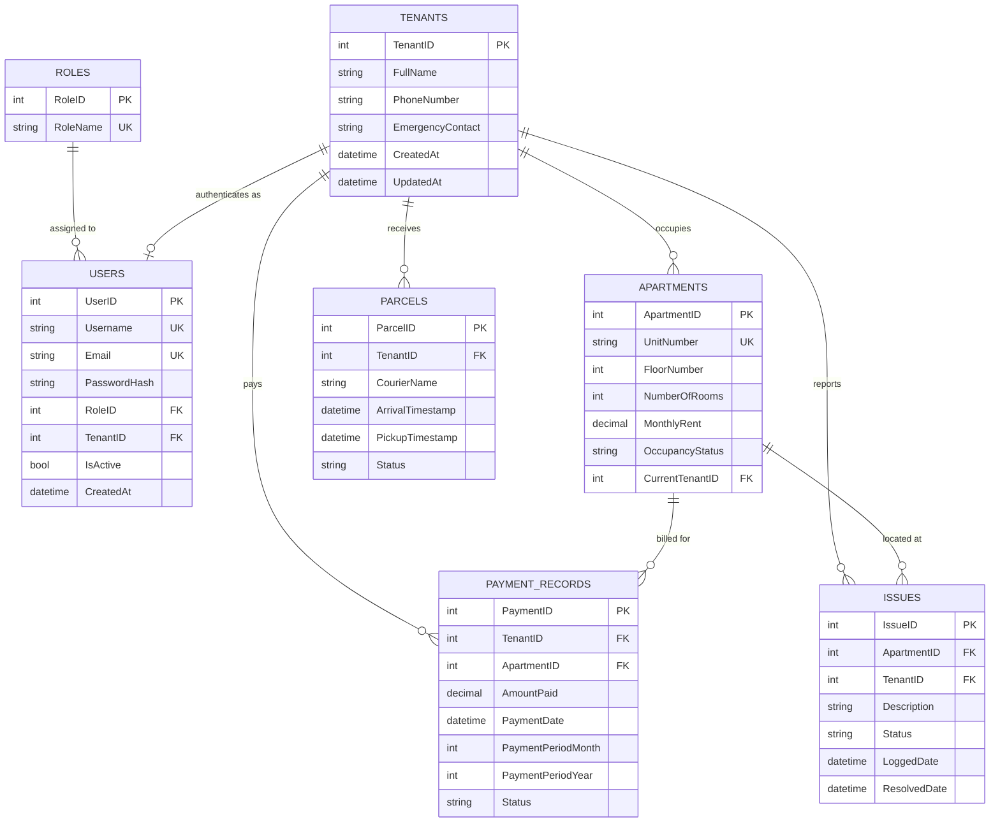

# Context & System Scope Specification: Apartment Management System (AMS)

> **Purpose:** This document is the **single source of truth** for AI agents and developers working on the Apartment Management System. It is extracted strictly from the official **IT Project Management (ITPM)** documentation suite (Project Charter, Scope Statement, WBS, Business Case, RACI Matrix, Risk Register, Issue Log, Change Log, and Stakeholder Register).
>
> **CRITICAL DIRECTIVE FOR AI AGENTS:** You must strictly abide by the scope, boundaries, data models, and constraints defined in this document. **Any suggestion, implementation, or inclusion of Out-of-Scope features (e.g., cloud sync, online payment gateways, mobile apps, SMS APIs) constitutes scope creep and is strictly forbidden.**

---

## 1. Project Overview & Identity

* **Project Name:** Apartment Management System (AMS)
* **Project Type:** Desktop-based, local-first Property Management Software (V1.0)
* **Primary Target Users:** Local Apartment Building Managers and Building Owners
* **Target Operating Environment:** Windows 10 / 11 Desktop (100% Offline capability)
* **Core Problem Solved:** Property managers rely on manual paper ledgers, fragmented logs, and memory to track rent, vacancies, parcel deliveries, and repair requests. AMS digitizes and centralizes these operations into a single offline desktop interface with zero calculation errors and sub-minute transaction logging.

### 1.1 Project Governance & Stakeholders

| Stakeholder Name | Role / Title | Responsibility Focus | Influence / Interest |
| :--- | :--- | :--- | :--- |
| **Eng. Rasheed Aldhaferi** | Project Sponsor / Course Instructor | Project authorization, formal reviews, and academic evaluation. | High / High |
| **Mohammed Alsamawi** | Project Manager / Product Owner / Strategic Lead | Scope definition, WBS decomposition, Charter, Business Case, and Backlog management. | High / High |
| **Aiham Alhalmi** | Operations Lead / Scrum Master / Governance Lead | Risk register, Issue log, RACI enforcement, Change Control, and Milestone tracking. | High / High |
| **Habib Sabri** | Technical Team Member | Technical implementation, SQLite database layer, and backup utilities. | Medium / Medium |
| **Building / Property Managers** | Primary End Users (External) | Operational rent logging, parcel intake, and maintenance issue tracking. | Medium / High |
| **Building Owners** | Business Owners / Investors (External) | Accurate financial reporting, overdue balances, and data integrity. | High / Medium |
| **Apartment Tenants** | Secondary Beneficiaries | Accurate receipts, timely maintenance, and secure package pickups. | Low / Medium |

---

## 2. Strict Project Boundaries & Scope Control

```
┌─────────────────────────────────────────────────────────────────────────────┐
│                             IN-SCOPE BOUNDARY                               │
│                                                                             │
│  ┌────────────────────────┐  ┌───────────────────────┐  ┌────────────────┐  │
│  │ 1. Occupancy & Units   │  │ 2. Rent & Payments    │  │ 3. Maintenance │  │
│  │    (Vacant/Occupied)   │  │    (Cash/Dockets)     │  │    (Issues)    │  │
│  └────────────────────────┘  └───────────────────────┘  └────────────────┘  │
│  ┌────────────────────────┐  ┌───────────────────────┐  ┌────────────────┐  │
│  │ 4. Parcel Receiving    │  │ 5. Offline Database   │  │ 6. PDF/Arabic  │  │
│  │    (Pickup Tracking)   │  │    (Local Backups)    │  │    (CR-002/003)│  │
│  └────────────────────────┘  └───────────────────────┘  └────────────────┘  │
└─────────────────────────────────────────────────────────────────────────────┘
                                      ▲
                                      │ STRICT WALL (ZERO CREEP)
                                      ▼
┌─────────────────────────────────────────────────────────────────────────────┐
│                         FORBIDDEN / OUT-OF-SCOPE                            │
│  ❌ Online Payment Gateways (Jaib, OneCash, Stripe, Bank APIs) [CR-001]     │
│  ❌ Cloud Database Synchronization & Remote APIs                            │
│  ❌ Mobile Applications (iOS / Android)                                     │
│  ❌ Automated SMS / Email Gateways (Twilio, SendGrid)                       │
│  ❌ Multi-Building Enterprise SaaS Multi-Tenancy Architecture               │
└─────────────────────────────────────────────────────────────────────────────┘
```

### 2.1 In-Scope Functional Modules (By the Letter - WBS 1.4)

Every technical task must map strictly to one of the following 5 core modules or approved changes:

#### Module 1: Apartment & Occupancy Management (WBS 1.4.1)
* Unit creation and room mapping (Unit Number, Floor Number, Room Count, Monthly Rent rate).
* Real-time unit occupancy status tracking: `Vacant`, `Occupied`, `Under Maintenance`.
* Tenant assignment to vacant units and vacancy release workflow.
* Validation rule: Units cannot have negative rent values; tenants cannot be assigned to non-vacant units.

#### Module 2: Rent & Payment Tracking Module (`PaymentRecord`) (WBS 1.4.2)
* Local rent computation and logging for cash/direct offline payments.
* Support for full, partial, and pending payments (`Paid`, `Partial`, `Pending`).
* Month (1–12) and Year payment docket assignment.
* Overdue balance calculation and printable local transaction receipts.
* **Accuracy Invariant:** 100% mathematical precision with decimal rounding protection (zero rounding discrepancies).

#### Module 3: Maintenance & Issue Logging Module (`Issue`) (WBS 1.4.3)
* Logging repair and maintenance service requests linked to specific apartments and tenants.
* Priority classification and repair cost tracking.
* Resolution workflow tracking: `Open` ➔ `In Progress` ➔ `Resolved`.
* Automatic tracking of `LoggedDate` and `ResolvedDate`.

#### Module 4: Package & Parcel Receiving Module (`Parcel`) (WBS 1.4.4)
* Package arrival check-in: Tenant name/ID, Courier name, Arrival Timestamp.
* Tenant pickup confirmation logging with Pickup Timestamp and Status transition (`Pending Pickup` ➔ `Picked Up`).
* **Performance Requirement:** Operational workflow designed to complete parcel check-in/pick-up in **< 1 minute** per entry.

#### Module 5: Local Database & Persistence Layer (WBS 1.4.5)
* Embedded local relational database schema (SQLite / Local SQL Server).
* Transaction rollback protection (ACID compliance) preventing data corruption on unexpected power loss or app termination.
* Automated and manual local database backup and restore utilities (`.bak` / `.db` file exports).
* Secure user authentication with cryptographic password hashing for local user accounts.

#### Approved Scope Modifications (From Official Change Log)
* **CR-002 (Approved):** Export maintenance reports and summary logs to local PDF files.
* **CR-003 (Approved):** Multi-language UI localization support (Arabic / English toggle).

---

## 2.2 Explicitly Out-of-Scope (Strictly Forbidden List)

The following items are **categorically excluded** from the project. AI agents must **never** write, generate, or propose code, dependencies, or architectural designs for:

1. ❌ **Online Payment Gateways & Digital Wallets:**
   * *Status:* Explicitly **REJECTED** via Formal Change Request **CR-001**.
   * *Forbidden:* No integrations with Jaib, Floos, OneCash, Stripe, PayPal, or banking APIs. All transactions are logged manually as local dockets/cash.
2. ❌ **Cloud Database Synchronization & Multi-Site APIs:**
   * *Forbidden:* No remote cloud databases (Firebase, AWS DynamoDB, Azure SQL Server), no REST API sync, and no web hosting.
3. ❌ **Tenant Mobile Applications:**
   * *Forbidden:* No mobile applications (iOS, Android, React Native, Flutter). The system is solely a manager-facing Windows desktop GUI.
4. ❌ **Automated SMS & Email Notification Gateways:**
   * *Forbidden:* No external messaging APIs (Twilio, SendGrid, SMPP). Tenant communication is handled locally via printed receipts or in-person interactions.
5. ❌ **Multi-Building Enterprise SaaS Multi-Tenancy:**
   * *Forbidden:* No complex cloud multi-organization routing. The system is optimized for a single building or local manager standalone workstation.

---

## 3. Data Schema & Entity Specifications

The local database schema must strictly adhere to the following entities and relational integrity constraints:



### 3.1 Field-Level Constraints & Invariants

| Entity | Field | Constraint / Rule |
| :--- | :--- | :--- |
| **`Tenants`** | `FullName`, `PhoneNumber` | Mandatory, non-empty. Phone length $\le 20$. |
| **`Apartments`** | `UnitNumber` | Mandatory, **UNIQUE**, max 20 characters. |
| | `MonthlyRent` | **`CHECK (MonthlyRent >= 0)`**. Decimal precision $(10, 2)$. |
| | `OccupancyStatus` | **`CHECK (OccupancyStatus IN ('Vacant', 'Occupied', 'Maintenance'))`**, default `'Vacant'`. |
| | `CurrentTenantID` | Nullable FK linking to `Tenants(TenantID)` with `ON DELETE SET NULL`. |
| **`PaymentRecords`** | `AmountPaid` | **`CHECK (AmountPaid > 0)`**. Decimal precision $(10, 2)$. |
| | `PaymentPeriodMonth` | **`CHECK (PaymentPeriodMonth BETWEEN 1 AND 12)`**. |
| | `Status` | **`CHECK (Status IN ('Paid', 'Partial', 'Pending'))`**, default `'Paid'`. |
| **`Issues`** | `Description` | Max length 500 characters. |
| | `Status` | **`CHECK (Status IN ('Open', 'In Progress', 'Resolved'))`**, default `'Open'`. |
| | `ResolvedDate` | Nullable; populated automatically when `Status` becomes `'Resolved'`. |
| **`Parcels`** | `Status` | **`CHECK (Status IN ('Pending Pickup', 'Picked Up'))`**, default `'Pending Pickup'`. |
| | `PickupTimestamp` | Nullable; populated upon tenant pickup confirmation. |
| **`Roles`** | `RoleName` | **UNIQUE** (`'Building Owner'`, `'Building Manager'`, `'Tenant'`). |
| **`Users`** | `Username`, `Email` | **UNIQUE**, non-empty. |
| | `PasswordHash` | Cryptographic hash (e.g., PBKDF2/BCrypt), never stored in plain text. |
| | `TenantID` | **UNIQUE** FK linking to `Tenants(TenantID)` with `ON DELETE SET NULL` (1-to-1 account link). |

---

## 4. Non-Functional Requirements & Project Constraints

1. **100% Offline Operational Continuity:**
   * The application must launch, read, write, query, and generate reports with **zero internet connection**.
2. **Transaction Speed & Ergonomics:**
   * Routine daily transactions (logging rent payments, entering parcel arrivals, logging repairs) must require **< 1 minute** per entry with minimal clicks.
3. **Data Integrity & Crash Resilience (RSK-001):**
   * The local database must enforce ACID transactions. Unplanned shutdowns or power cuts must result in zero record corruption or phantom writes.
   * A local backup mechanism must allow manual or automated exports to disk.
4. **Zero Budget Constraint:**
   * Development relies strictly on open-source libraries, free developer toolchains, and embedded database engines without commercial licensing fees.
5. **Single-Workstation Concurrency:**
   * Concurrency is managed locally on the host machine. Multi-user concurrent cloud sync is not required.

---

## 5. Work Breakdown Structure (WBS) Reference

All codebase activities must strictly correspond to the approved WBS dictionary:

* `1.1` **Project Initiation Documents** (Problem Statement, Team Charter, Project Charter, Business Case)
* `1.2` **Stakeholder & Scope Management** (Stakeholder Register, System Boundaries, Scope Statement)
* `1.3` **Project Baseline Planning** (WBS, Milestone Plan, RACI Matrix, Risk Register, Communication Plan)
* `1.4` **Software System Architecture & Implementation**
  * `1.4.1` Occupancy Management Module
  * `1.4.2` Rent & Payment Module (`PaymentRecord`)
  * `1.4.3` Maintenance Logging Module (`Issue`)
  * `1.4.4` Package Receiving Module (`Parcel`)
  * `1.4.5` Offline SQLite Database Layer & Backup Utility
* `1.5` **Project Control, Quality & Change Management** (Quality Checklist, Issue Log, Change Control System)
* `1.6` **Agile Framework & Project Closure** (Product Backlog, Sprint Planning, Midterm Portfolio, Final Presentation)

---

## 6. Rules for AI Agents Working on This Codebase

When writing code, reviewing pull requests, generating features, or answering questions:

1. **Never Violate System Boundaries:**
   * If asked to add online payments, cloud hosting, mobile apps, or web APIs, **refuse and cite CR-001, WBS 1.2.2, and this context document**.
2. **Adhere to the Layered Architecture:**
   * Maintain separation between **Domain** (business entities & rules), **Application** (DTOs & service interfaces), and **Infrastructure** (EF Core DbContext & repositories).
3. **Enforce Financial Accuracy:**
   * Always use `decimal` for monetary values (`MonthlyRent`, `AmountPaid`). Never use floating-point types (`float` or `double`) for money.
4. **Maintain Database Integrity:**
   * Ensure foreign keys, cascades, uniqueness constraints, and check constraints match the schema in [`ApartmentManagmentSchema.sql`](file:///home/mohammed/Documents/projects/ApartmentManagementSystem/ApartmentManagmentSchema.sql).
5. **Keep UI Local-First:**
   * All UI dialogues and workflows must target local desktop presentation without web-browser dependencies.
